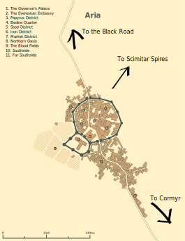

# Building Aria
These are my somewhat-freeform (but somewhat organized...) thoughts as I flesh out Aria.

## How many people live in Aria?

According to the definitions put forth in the Dungeon Master's Guide, Aria is likely somewhere between a village and a town, with a population that is over 1000 but beneath 6000. At first blush, I imagine around 5000 people. Insofar as D&D bears any connection to "contemporary" agrarian societies in medieval Europe, this would be quite a large settlement. However, Aria is a bit different. English hamlets were situated on relatively arable land and had the freedom to space out relatively evenly. In the desert, I imagine that there's a much stronger tendency toward huddling together for safety. This concept is born out, at least in numbers, by looking at our own history: [Arab cities tended to be much larger than their contemporary European counterparts prior to 1800](https://voxeu.org/article/1000-years-urban-history-rise-and-fall-european-and-arab-cities). I am doubtless sweeping a library's worth of important historical nuance under the rug by chalking this up to "safety in numbers" (indeed, the article I linked provides a much more in-depth analysis of the disparity), but I think this reasoning passes the sniff test and it isn't _too_ hard to imagine that a desert archaeological outpost would coalesce into one stronghold rather than being a series of spaced-out settlements.

## How big is Aria?
According to this [random stranger on the internet](http://donjon.bin.sh/fantasy/demographics/), a 5000-person medieval town would be 82 acres, corresponding to a population density of 61 people per acre. For a square mile, which was roughly the size of medieval London, this yields a population of 39,000, [roughly correct for London in the late middle ages](https://en.wikipedia.org/wiki/Historical_urban_community_sizes). My current map of Aria looks something like this:

The basic idea is that the walled portion was the original Evereskan outpost, and the local Bedine and D'Tarig communities have gradually tacked on more and more; for every 100 nomads passing through, maybe a few decide to stick around. The road through Aria continues North and dead-ends into the Black Road -- even though the route is longer, this is generally considered the safest way to ship metal back to Evereska. The scale bar on the map makes Aria roughly 900 meters by 300 meters, or 67 acres. 67 times 61 is 4087, so that's relatively consistent with the population density estimates detailed earlier.

## The Town Itself
More details coming soon about what those things on the map actually __are__ :)
